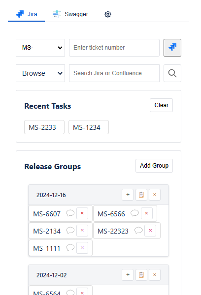

# Task Helper Chrome Extension

A Chrome extension to help you quickly navigate to Jira tickets.

## Features

- Quickly navigate to Jira tickets by entering the ticket number.
- Maintain a history of recently accessed tickets.
- Customize the base URL for Jira.
- Add and manage ticket prefixes.
- Reset settings to default values.

## Demo



## Installation

1. Clone the repository:
    ```sh
    git clone https://github.com/DennisLiuCk/task-helper-chrome-ext.git
    ```
2. Open Chrome and navigate to `chrome://extensions/`.
3. Enable "Developer mode" by toggling the switch in the top right corner.
4. Click on "Load unpacked" and select the cloned repository folder.

## Usage

1. Click on the extension icon in the Chrome toolbar.
2. Enter the ticket number in the input field.
3. Click the "Submit" button or press "Enter" to open the ticket in a new tab.
4. Use the "Settings" button to configure the base URL, ticket prefixes, and other settings.

## Configuration

The extension can be configured via the settings page:

- **Jira Base URL**: The base URL for your Jira instance.
- **Ticket Prefixes**: Add or remove prefixes for ticket numbers.
- **Default Prefix**: Set the default prefix for ticket numbers.
- **Max History Items**: Set the maximum number of recent tickets to display.

## Local Configuration Setup

### Overview
The application supports local configuration overrides using `config.local.js`. This allows developers to maintain their own configuration without affecting the default settings or other developers' environments.

### Setup Steps

1. Create a new file named `config.local.js` in the root directory
2. Copy the structure from `config.js` that you want to override
3. Modify the values as needed

Example `config.local.js`:

```javascript
// config.local.js
window.LOCAL_CONFIG = {
    baseUrl: 'https://your-private-jira-url.com/browse/',
    swaggerLinks: [
        {
            name: 'user API',
            url: 'https://user-api.com/swagger-ui.html'
        },
        {
            name: 'store API',
            url: 'https://store-api.com/swagger-ui.html'
        }
    ]
};
```

### Configuration Precedence
The configuration system follows this precedence order (highest to lowest):
1. `config.local.js` (LOCAL_CONFIG)
2. User settings from storage
3. `config.js` (DEFAULT_CONFIG)

### Notes
- `config.local.js` is ignored by git to prevent accidental commits
- Only include the settings you want to override
- The configuration is deep merged, so you only need to specify the values you want